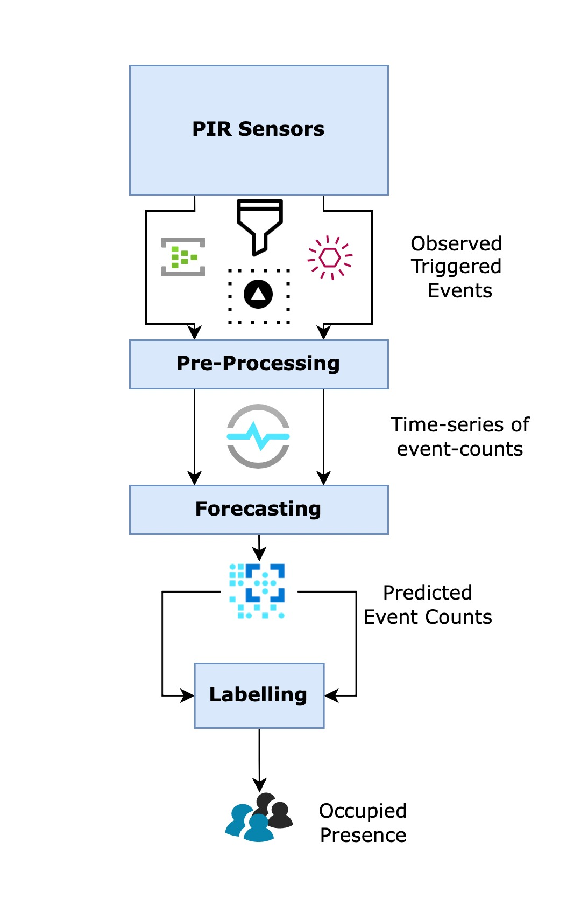

# Occupancy Prediction with Facebook Prophet

_ref article for all along the project: [Prophet model for forecasting occupancy presence in indoor spaces using non-intrusive sensors](https://agile-giss.copernicus.org/articles/2/9/2021/agile-giss-2-9-2021.pdf)_

Passive infrared sensors have widespread use in many applications, including motion detectors for alarms, lighting systems, and hand dryers. I have tried to predict the occupancy presence inside of a monitored environment. Our problem could be stated as binary time series forecasting because the provided dataset contains a timestamp and a binary column. However, in this challenge, I have used event count for predicting the results while developing the model.

The developed forecast algorithm for the case was applied device by device. So, it can be reached out to each model from the model folder. At the end of the running project, all device predictions were added to the one dataframe.



## Docker Commands

```docker build -t $image_name -f Dockerfile .```

```docker run $image_name --timestamp $TIMESTAMP --input_file_csv $INPUT_FILE_NAME --output_file_csv $OUTPUT_FILE_NAME --time_frame $TIME_FRAME```

- Example;

```docker build -t occpred -f Dockerfile .```

```docker run occpred --input_file_csv 'device_activations.csv' --output_file_csv 'solutions.csv'```
